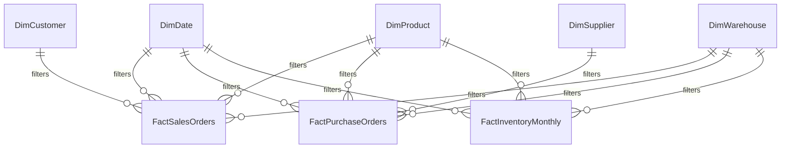

# Semantic Model

```mermaid
erDiagram
    DimDate ||--o{ FactSalesOrders : filters
    DimProduct ||--o{ FactSalesOrders : filters
    DimWarehouse ||--o{ FactSalesOrders : filters
    DimCustomer ||--o{ FactSalesOrders : filters
    DimDate ||--o{ FactPurchaseOrders : filters
    DimProduct ||--o{ FactPurchaseOrders : filters
    DimSupplier ||--o{ FactPurchaseOrders : filters
    DimWarehouse ||--o{ FactPurchaseOrders : filters
    DimDate ||--o{ FactInventoryMonthly : filters
    DimProduct ||--o{ FactInventoryMonthly : filters
    DimWarehouse ||--o{ FactInventoryMonthly : filters
```
